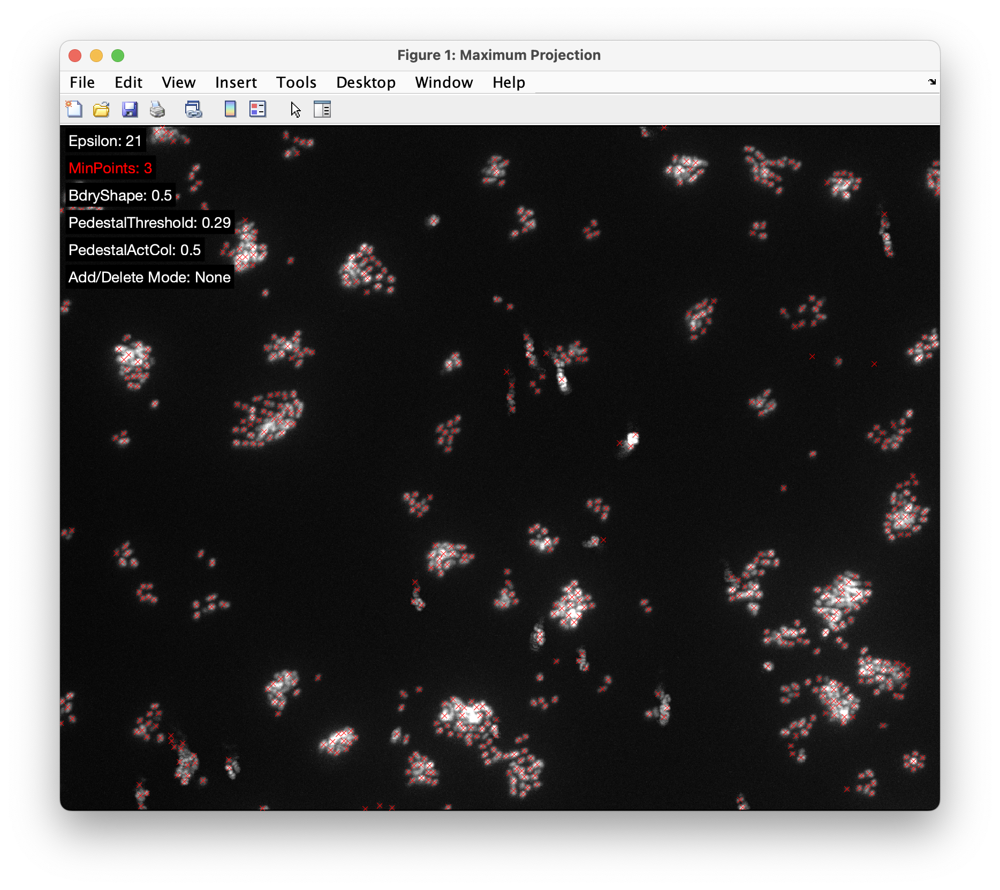
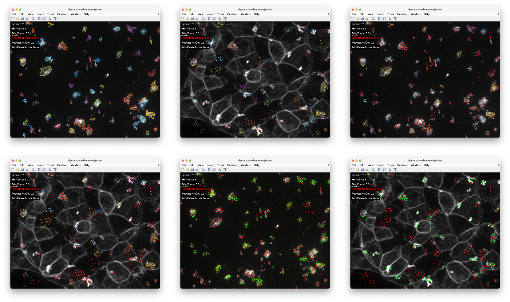

# ColonyCounter
MATLAB GUI for Semi-Automatic Quantification of Bacteria Colonies

## Installation
As a first step download or clone the repository to your machine. ColonyCounter additionally requires XPIWIT used for preprocessing the data, i.e., to detect and segment objects in the 2D images. The latest version of XPIWIT can be obtained from [https://bitbucket.org/jstegmaier/xpiwit/downloads/](https://bitbucket.org/jstegmaier/xpiwit/downloads/). Copy the contents of the `Bin` folder of the binary distribution of XPIWIT to the subfolder `%COLONYCOUNTER%/Source/XPIWIT/{Windows,MacOSX,Ubuntu}`, where `%COLONYCOUNTER%` refers to the main folder you extracted the ColonyCounter repository to. Depending on the used operating system, a different binary version is neccessary and thus the respective subfolder should be created accordingly. Note that all platforms except of Windows are case sensitive, i.e., make sure to use the same capitalization as mentioned above. You can double-check if XPIWIT works properly by double-clicking the `XPIWIT.exe` from the Windows Explorer or by calling `./XPIWIT.sh` in the Terminal of Unix-based systems. Make sure to adjust permissions accordingly, in case you're not allowed to execute this file.
 
## Data Import
The input format are 2D images in the *.tif* format. The GFP channel images are assumed to contain the suffix *GFP*, such  that the wild-card search string `*GFP*.tif` applies to the files to process. If the file open dialog does not show any available files, double-check that your input files match the naming scheme. Moreover, the file name for the second channel is assumed to be identical, except for replacing `GFP` with `Phalloidin`. Also note that the absolute path including the file name should **not** contain any space characters nor any special characters. After selection of an input file was successful, the GUI will ask for an output folder. Select any appropriate folder and again make sure there are no space characters in the absolute path to the output folder. The GUI will then automatically start `XPIWIT.exe` to detect bacteria in the GFP channel and to perform an instance segmentation [1,2]. 

## GUI Functionality
This may take a few seconds and after this the results should automatically appear in a newly opened figure in MATLAB, similar to the screenshot below:

 

To get an overview of the project, you can use keys 1 - 7 for different visualization modes that superimpose the detections and segmentation on the raw images. The following image shows a few examples of different visualizations:

On the top-left of the main window the current parameter settings are listed. Use the `P` button to toggle between the different parameter values. The currently selected parameter is highlighted in red. Use the up and down arrow keys to increase and decrease the parameter values, respectively.

The following parameters can be adjusted:
- The first two parameters control the behavior of the DBSCAN algorithm that is used to automatically identify clusters in the data that correspond to bacteria colonies. `Epsilon` specifies the radius of the neighborhood used for density calculations. Moreover, `MinPoints` specifies the minimum number of points in the Epsilon-neighborhood required for a point to be considered as a core point. Please refer to the original publication of DBSCAN for more information on the rational of these parameters and the details of the algorithm [3]. The clustering is applied upon pressing the `B` or by adjusting one of the parameters. 
- The parameter `BdryShape` controls the appearance of the boundaries of the colonies. Values range from 0 for the convex hull to 1 for a compact boundary of the point set. See [https://de.mathworks.com/help/matlab/ref/boundary.html](https://de.mathworks.com/help/matlab/ref/boundary.html) for more details.
- The parameter `PedestalThreshold` controls the intensity level required by a bacterium to be counted as *active*, i.e., as having formed a pedestal. Active bacteria are highlighted in green and inactive ones in red. The visualization mode `6` is useful for adjusting this pedestal threshold. The smaller the parameter, the more bacteria will be considered active.
- The parameter `Add/Delete Mode` can be separately toggled using the `A` button. This controls how bacteria and colonies can be added and removed. In the default setting `None`, mouse clicks are simply ignored. Setting it to `Bacteria` allows you to add/remove bacteria. Simply left-click at a particular position to add a detection. Upon pressing the right mouse button, the detection closest to the cursor will be removed. Setting this parameter to `Colonies` allows to select/deselect colonies. Similarly, just use the left or right mouse button to select/deselect a colony. Quantifications are only performed on selected colonies, so this feature is useful to deselect colonies at the image borders that are potentially incomplete.

After all parameters have been set properly, the results can be exported using the `E` key. In addition to qualitative result images, different colony-dependent statistics are computed and displayed:

An overview of available keyboard commands can be opened using the `H` key and the following keyboard commands are available:

* 1,2,3,4,5,6,7: Toggles the visualization of different channels and detections
* Up Arrow: Increase selected threshold (highlighted in red)
* Down Arrow: Decrease selected threshold (highlighted in red)
* Left Arrow: Go to previous slice (only works in slice mode)
* Right Arrow: Go to next slice (only works in slice mode)
* +/-: Increase or decrease gamma exponent for contrast adjustment
* A: Add/remove bacteria or colonies (left-click to add, right-click to delete)
* B: Boundary visualization on/off
* C: Toggle color map
* D: Detections visualization on/off
* E: Export results (two csv files *_grouped.csv and *_counts.csv)
* H: Show this help dialog so you probably already know about this button :-)
* I: Show information about colony ids and their size 
* S: Show/hide the parameter information on the top left
* M: Show measurements for current parameter selection
* O: Zoom out to the original view
* P: Change to the next parameter
* R: Reset parameters to the default values
* V: Toggle aspect ratio (stretch or equal)
* Mouse Wheel: Scroll through slices (only works in slice-mode)
* CTRL + Mouse Wheel: Zoom in/out in a Google-Maps like behavior

**Hint:** In case key presses show no effect, left click once on the image and try hitting the button again. This only happens if the window looses the focus.

## References

1. Stegmaier, J., Otte, J. C., Kobitski, A., Bartschat, A., Garcia, A., Nienhaus, G. U., Strähle, U. & Mikut, R. (2014). Fast Segmentation of Stained Nuclei in Terabyte-Scale, Time Resolved 3D Microscopy Image Stacks. *PLOS ONE*, 9(2), e90036.

2. Bartschat, A., Hübner, E., Reischl, M., Mikut, R., & Stegmaier, J. (2016). XPIWIT—an XML Pipeline Wrapper for the Insight Toolkit. *Bioinformatics*, 32(2), 315-317.

3. Ester, M., Kriegel, H. P., Sander, J., & Xu, X. (1996). A Density-based Algorithm for Discovering Clusters in Large Spatial Databases with Noise. In *KDD*, 96(34), 226-231.
